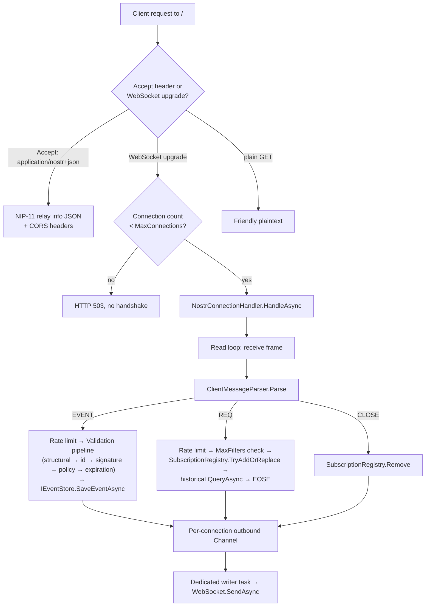
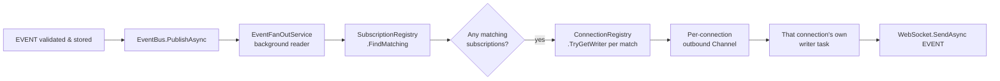

# NostrRelay.NET

A production-grade [Nostr](https://github.com/nostr-protocol/nostr) relay written in C# / .NET 10.

[](https://github.com/gpeterson12/nostr-relay-dotnet/actions/workflows/ci.yml)
[](LICENSE)

> **Status: active development, first README draft.** Milestones 1–9 are complete; Milestone 11
> (benchmarking) is in progress. See [Known Gaps & Roadmap](#known-gaps--roadmap) for exactly
> what's built, what's deferred, and why.

## Why this exists

I built this to get hands-on experience with decentralized protocols and open-source
development, and to learn a little bit about Nostr. Nostr's simplicity (no blockchain, no
token, just signed events and dumb-pipe relays) made it an approachable entry point into
decentralized systems without years of distributed-systems background as a prerequisite.

It also happened to fill a real gap: at the time this project began, not a ton of C#/.NET
Nostr relay implementation existed, despite active implementations in Rust, Go, TypeScript,
Clojure, and C++. Beyond the learning goal, this project doubles as a demonstration of
senior-level .NET backend engineering: clean architecture, concurrency correctness, measurable
performance, dual-datastore support, comprehensive testing, and observability - not just
CRUD-over-HTTP.

It's built to actually work: it accepts connections from real Nostr clients (Damus, Amethyst,
Primal, Coracle, etc.) and interoperates with the live network, not just its own test suite.

## Supported NIPs

| NIP | Name | Status |
|---|---|---|
| [01](https://github.com/nostr-protocol/nips/blob/master/01.md) | Basic protocol flow | ✅ Implemented |
| [09](https://github.com/nostr-protocol/nips/blob/master/09.md) | Event deletion | ✅ Implemented |
| [11](https://github.com/nostr-protocol/nips/blob/master/11.md) | Relay information document | ✅ Implemented |
| [40](https://github.com/nostr-protocol/nips/blob/master/40.md) | Expiration timestamp | ✅ Implemented |
| [70](https://github.com/nostr-protocol/nips/blob/master/70.md) | Protected events | ⏸ Deferred - needs NIP-42 auth first, see [below](#known-gaps--roadmap) |
| [42](https://github.com/nostr-protocol/nips/blob/master/42.md) | Client authentication | 📋 Planned |
| [45](https://github.com/nostr-protocol/nips/blob/master/45.md) | Event counts | 📋 Planned |
| [50](https://github.com/nostr-protocol/nips/blob/master/50.md) | Search capability | 📋 Planned |
| [13](https://github.com/nostr-protocol/nips/blob/master/13.md) | Proof of work | 📋 Planned |
| [65](https://github.com/nostr-protocol/nips/blob/master/65.md) | Relay list metadata | 📋 Planned |

This table is also served live by the relay itself - `GET /` with `Accept: application/nostr+json`
returns the current `supported_nips` list, sourced from the same place this table is, so the two
can't drift apart silently.

## Architecture

### Request routing

A single WebSocket endpoint handles the whole protocol, per NIP-01 ("relays MUST only accept
connections to a single endpoint") and NIP-11 (served on that same URI via content negotiation):



Two separate, non-WebSocket routes exist alongside this: `GET /health` (liveness/readiness,
exercises real storage connectivity) and `GET /metrics` (Prometheus text exposition).

### Publish → live fan-out pipeline

The concurrency-critical path (Section 5.3 of the project spec): every connection's read loop
and write loop run independently, decoupled by a central event bus, so one slow subscriber can
never block event ingestion or any other connection.



`EventBus` is bounded with a **wait** policy (Section 4.2: no event loss on ingestion - a full
bus makes publishers wait, never drop). Each connection's outbound channel is bounded with a
**drop-oldest** policy instead - an isolated, acceptable cost that only affects one slow client,
never the bus or any other connection.

### Storage abstraction

`IEventStore` is the seam between protocol logic and persistence. Two implementations exist -
`SqliteEventStore` and `PostgresEventStore` - both proven behaviorally identical by a single
shared contract test suite (`EventStoreContractTests`, 30 tests, run unmodified against both
providers). They reach that identical behavior by genuinely different means where the underlying
engines differ: SQLite uses a whole-database `BEGIN IMMEDIATE` write lock for replaceable/
addressable event upserts, Postgres uses a per-key `pg_advisory_xact_lock` instead, more
surgical since only writers to the *same* key ever contend.

```
src/
  NostrRelay.Core                 # Domain: NostrEvent, NostrFilter, validation pipeline,
                                   # kind-strategy classification, crypto wrapper, wire protocol
  NostrRelay.Storage.Abstractions # IEventStore, PersistResult
  NostrRelay.Storage.Sqlite       # First provider
  NostrRelay.Storage.Postgres     # Second provider, same contract tests
  NostrRelay.Server               # ASP.NET Core host: WebSocket handling, subscriptions,
                                   # fan-out bus, policy/limits, NIP-11/health/metrics endpoints
  NostrRelay.Cli                  # Scaffolded, not yet built out
tests/
  NostrRelay.Core.Tests
  NostrRelay.Storage.Tests        # Contract tests, run against both providers
  NostrRelay.Server.IntegrationTests  # Real WebSocket client against an in-memory host
  NostrRelay.Benchmarks           # BenchmarkDotNet micro-benchmarks
```

## Quickstart

Docker packaging is planned (Milestone 12) but not built yet - for now, run directly:

```bash
# SQLite (default, zero setup - the .db file is created automatically on first run)
dotnet run --project src/NostrRelay.Server

# Postgres instead: set Storage:Provider in appsettings.Development.json, or via env var
Storage__Provider=Postgres Storage__ConnectionString="Host=localhost;Database=nostr_relay_dev" \
  dotnet run --project src/NostrRelay.Server
```

Then connect with any Nostr client at `ws://localhost:5256` (port may vary - check the startup
log), or try it from the command line:

```bash
# Relay info document
curl -s -H "Accept: application/nostr+json" http://localhost:5256/ | jq

# Publish and query using nak (https://github.com/fiatjaf/nak)
nak event -c "hello relay" http://localhost:5256
nak req -k 1 http://localhost:5256
```

## Configuration reference

All sections below are optional; defaults shown are what the relay uses if omitted.

```json
{
  "Storage": {
    "Provider": "Sqlite",
    "ConnectionString": "Data Source=relay.db"
  },
  "Relay": {
    "Name": "nostr-relay-dotnet",
    "Description": "A Nostr relay written in C#/.NET",
    "Software": "https://github.com/<your-username>/nostr-relay-dotnet",
    "Version": "0.1.0",
    "ContactPubkey": "",
    "Contact": ""
  },
  "Limits": {
    "MaxConnections": 5000,
    "MaxSubscriptionsPerConnection": 20,
    "MaxFiltersPerSubscription": 10,
    "MaxEventSizeBytes": 65536,
    "EventRateLimitPerMinute": 300,
    "CreatedAtLowerLimitSeconds": 94608000,
    "CreatedAtUpperLimitSeconds": 300,
    "OutboundChannelCapacity": 256,
    "EventBusCapacity": 1000
  },
  "Policy": {
    "PubkeyAllowlist": [],
    "PubkeyBlocklist": [],
    "KindBlocklist": []
  },
  "ExpirationSweep": {
    "IntervalSeconds": 300
  }
}
```

Every one of these values is the *actual* enforced value - the NIP-11 `limitation` object served
at `GET /` (with `Accept: application/nostr+json`) is built directly from this same
configuration, not a separately-maintained set of numbers that could drift out of sync.

Postgres-specific: the relay will create the target database itself on first connect if the
connecting role has `CREATEDB` (true for local Postgres.app/Docker setups, usually false for
managed production Postgres, where it fails soft and assumes the database was already
provisioned by infrastructure tooling).

## Testing

```bash
# Everything
dotnet test

# Just one project (faster iteration)
dotnet test tests/NostrRelay.Core.Tests
dotnet test tests/NostrRelay.Storage.Tests          # needs a local Postgres, see below
dotnet test tests/NostrRelay.Server.IntegrationTests

# Filter to a class or method
dotnet test --filter "FullyQualifiedName~SubscriptionRegistry"
```

`NostrRelay.Storage.Tests` runs the same 30-test contract suite against both SQLite (a fresh
temp-file database per test, deleted after) and Postgres (a dedicated dropped-after schema per
test, inside one shared database). Postgres tests need a reachable server:

```bash
createdb nostr_relay_test   # only if the relay's own auto-provisioning can't (needs CREATEDB)
```

Override the connection string via `NOSTR_RELAY_TEST_POSTGRES_CONNECTION_STRING` if your local
setup differs from Postgres.app's defaults (`Host=localhost;Database=nostr_relay_test`).

### Test coverage by layer

| Layer | What's covered |
|---|---|
| `Core.Tests` | Canonical ID serialization, Schnorr sign/verify round-trips, the full validation pipeline, wire-format (de)serialization, kind classification, NIP-09 deletion parsing, NIP-40 expiration checks, policy allow/blocklists |
| `Storage.Tests` | Full `IEventStore` contract: all four kind-category persistence strategies, filter/tag/time-range/limit querying, NIP-09 deletion (both `e` and `a` tag forms), NIP-40 query-time exclusion and sweep, run against SQLite *and* Postgres |
| `Server.IntegrationTests` | Real WebSocket client against an in-memory `WebApplicationFactory` host: full protocol flows, live fan-out across separate connections, kind-strategy behavior end-to-end (not just at the storage layer), NIP-11/health/metrics HTTP endpoints, rate limiting, allowlist/blocklist, timestamp sanity, deletion, expiration |

## Benchmarks

Run with:

```bash
dotnet run -c Release --project tests/NostrRelay.Benchmarks
```

**Hardware:** Intel Core i7-1068NG7 @ 2.30GHz, 1 CPU / 8 logical / 4 physical cores, macOS Tahoe
26.5.1, .NET SDK 10.0.302, .NET 10.0.10 (BenchmarkDotNet v0.15.8).

### Signature verification

| Method | Mean | Allocated |
|---|---|---|
| `VerifyValidSignature` | 151.9 μs | 1,016 B |

**≈ 6,580 verifications/sec, single-threaded.** This uses NBitcoin.Secp256k1, a managed
implementation, not the highly-optimized C `libsecp256k1` most production relays link against
directly, so this number is plausible but not best-in-class. It is not currently a bottleneck
anywhere in the system (see filter matching, below) - if it ever becomes one under real load,
the right lever is parallelizing verification across events, an embarrassingly parallel
workload, rather than trying to speed up a single call.

### Filter matching

| Method | Mean | Ratio | Allocated |
|---|---|---|---|
| `SimpleKindMatch` | 3.107 ns | 1.00 | - |
| `TagFilterMatch` | 63.856 ns | 20.56 | 184 B |
| `MultiConditionMatch` | 113.314 ns | 36.48 | 312 B |

Even the most expensive filter shape benchmarked (113 ns) is roughly **1,340× cheaper** than a
single signature verification (151,900 ns). Filter matching is not a meaningful cost anywhere in
this system, regardless of filter complexity.

### Subscription fan-out matching

Section 5.3's explicit performance target: *"within single-digit milliseconds... independent of
total subscriber count up to at least 10,000 active subscriptions."*

| Subscriptions | Mean | Allocated |
|---|---|---|
| 100 | 3.122 μs | 3.69 KB |
| 1,000 | 36.692 μs | 34.63 KB |
| 10,000 | 486.313 μs | 344 KB |

**Target met:** 0.486 ms at 10,000 subscriptions (worst case - none matching, forcing a full
scan) is well under a single millisecond, let alone single-digit milliseconds. Allocation scales
almost perfectly linearly (9.9× for a 10× subscriber increase), confirming the O(active
subscriptions) design goal. Time scales slightly super-linearly at the largest tier (13.25× for
10×) with higher variance, consistent with increased GC pressure from per-tag-condition closure
allocations in `NostrFilter.Matches` rather than an algorithmic issue - worth revisiting only if
the load-test harness (below) shows it mattering under sustained concurrent load.

### Not yet benchmarked

Event ingestion p99 latency and true concurrent-connection throughput need a real load-test
harness (many concurrent clients, real network I/O), not a microbenchmark - that's the next
piece of work. Query latency histograms and storage size aren't in `/metrics` yet either; see
below.

## Design philosophy

[NNostr](https://github.com/Kukks/NNostr) (Kukks/NNostr) is the most notable prior art in the
C#/.NET Nostr space: a combined client/relay library tightly coupled to BTCPay Server for
payment gating (per-event sats fees, admin configuration via DM commands), built on Postgres
only. Other C#/.NET Nostr projects may exist beyond the ones referenced here.

This project makes a deliberately different set of architectural choices, informed by that prior
art rather than filling an empty gap: general-purpose (no payment coupling), dual-backend
(SQLite for embedded/personal use, Postgres for scale), a documented Channels-based concurrency
architecture for the publish/subscribe fan-out pipeline, a contract-tested storage abstraction
proving behavioral parity across both providers rather than assuming it, and published
performance benchmarks.

## Known gaps & roadmap

Honest accounting of what's deferred, what's missing, and why - not a changelog.

### Deliberately deferred

- **NIP-70 (protected events), Milestone 10 → folded into Milestone 13.** NIP-70 requires
  knowing whether a connected client is authenticated as a specific event's author, which
  depends on NIP-42 auth. Building NIP-70 against a stub auth layer now would mean redoing it
  once real auth lands; better to build both together.
- **NIP-42 auth, NIP-45 counts, NIP-50 search, NIP-13 proof-of-work, NIP-65 relay lists -
  Milestone 13, not started.** `AUTH` and `COUNT` client messages currently receive a `NOTICE`
  saying they're not yet supported, rather than being silently ignored.
- **Docker/docker-compose packaging, `ARCHITECTURE.md`, deployment to a public endpoint, and
  interop validation against a real client (Damus/Amethyst/etc.) - Milestone 12, not started.**
  Everything in this repo has been validated against its own test suite and manual `curl`/`nak`/
  `websocat` sessions, not yet against the live Nostr network.
- **Load-test harness for concurrent-connection and ingestion-latency targets - rest of
  Milestone 11.** The BenchmarkDotNet results above cover CPU-bound micro-benchmarks; they don't
  exercise real concurrent WebSocket connections, network I/O, or sustained throughput.

### Known simplifications, not yet stress-tested

- **SQLite's `BEGIN IMMEDIATE` write lock** for replaceable/addressable upserts is a
  whole-database lock, correct but coarser than Postgres's per-key advisory lock. Fine for
  SQLite's typical embedded/single-writer use case; untested under heavy concurrent write load.
- **`EventFanOutService` iterates matching subscriptions sequentially**, not via
  `Parallel.ForEachAsync`. The spec calls out parallel dispatch as a benchmark-driven
  optimization, not a correctness requirement - the subscription fan-out benchmark above (0.486
  ms at 10k subscriptions) suggests it isn't needed yet, but this should be revisited if the load
  test shows otherwise under real concurrent publish load.
- **Rate limiting is per-connection only**, not per-pubkey (Section 4.3 lists per-pubkey as
  optional). A client can trivially bypass the rate limit by opening a new connection.

### Missing pieces worth naming

- **`NostrRelay.Cli`** is scaffolded in the solution but has no actual commands implemented
  (planned: manual event delete, allowlist management, export/import).
- **`/metrics` has no query latency histograms or storage size gauge.** Both were called out in
  Section 4.4 as desired but deferred as a bigger, more invasive instrumentation change better
  paired with the load-test work.
- **NIP-11's `limitation` object omits `max_limit`, `max_event_tags`, `max_content_length`, and
  `min_pow_difficulty`** because none of them are currently enforced - the document is written to
  only claim what's actually true, not what a typical NIP-11 response usually includes.
- **NIP-09's `a`-tag deletion doesn't handle the edge case of an empty d-identifier** referencing
  a plain replaceable event (kind 0/3/10000–19999) rather than an addressable one; the documented
  and tested path for deleting those is an `e` tag with the specific event id instead.
- **Multi-filter `REQ` results are concatenated per-filter, not globally merge-sorted** across
  filters - each filter's own results are most-recent-first, but the overall stream isn't. Noted
  as an acceptable simplification since Milestone 2, revisit if it ever matters in practice.

## License

MIT - see [LICENSE](LICENSE).